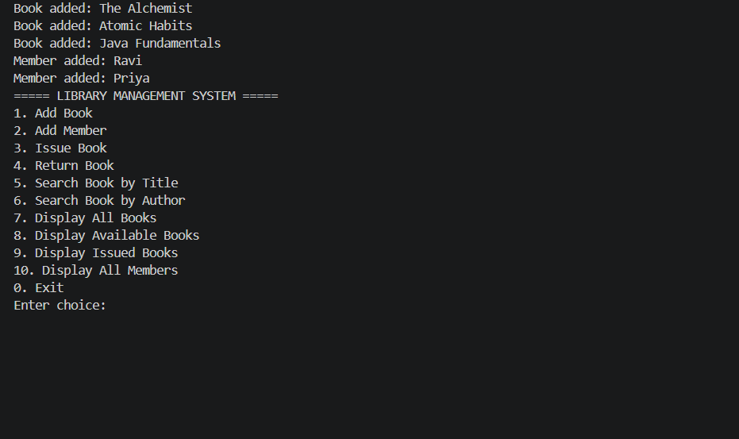
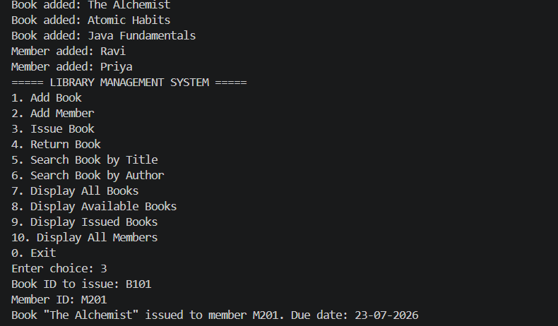
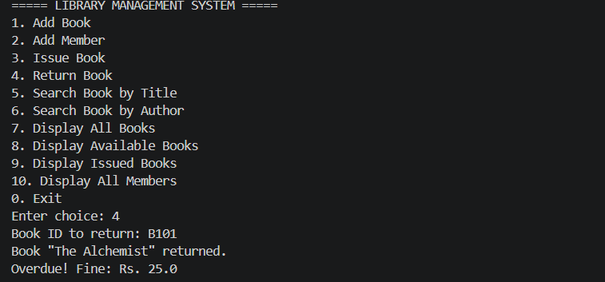

# 📚 Library Management System (Java)

A console-based Library Management System built using core Java concepts — OOP, Collections, custom exception handling, and date/time calculations. Simulates real-world library operations: adding books/members, issuing, returning, searching, and calculating overdue fines.

---

## Features

- Add new books and members
- Issue a book to a member (tracks issue date & due date)
- Return a book (auto-calculates overdue fine)
- Search books by title or author
- View all books / only available books
- View all currently issued books with due dates
- Custom exceptions for invalid operations (book not found, already issued, not a member, etc.)

---

## Tech Concepts Used

| Concept | Where it's used |
|---|---|
| OOP (Encapsulation) | `Book`, `Member` — private fields with getters/setters |
| Inheritance | `StudentMember extends Member` |
| Collections | `ArrayList<Book>` for listing, `HashMap<String, Book>` for fast ID lookup |
| Custom Exceptions | `BookNotFoundException`, `BookAlreadyIssuedException`, `BookNotIssuedException`, `InvalidMemberException` |
| Date/Time API | `LocalDate`, `ChronoUnit` for issue/due dates and fine calculation |
| Separation of Concerns | `FineCalculator` and `DateUtil` kept independent of core `Library` logic |

---

## Project Structure

```
LibraryManagementSystem/
├── Book.java
├── Member.java
├── StudentMember.java
├── Library.java
├── Main.java
├── BookNotFoundException.java
├── BookAlreadyIssuedException.java
├── BookNotIssuedException.java
├── InvalidMemberException.java
├── FineCalculator.java
├── DateUtil.java
└── README.md
```

---

## How to Run

1. Clone the repository:
   ```bash
   git clone https://github.com/YOUR-USERNAME/Library-Management-System-Java.git
   cd Library-Management-System-Java
   ```
2. Compile:
   ```bash
   javac *.java
   ```
3. Run:
   ```bash
   java Main
   ```

Requires Java 8 or higher (uses `java.time` package).

---

## Sample Output / Results

**On startup** (sample data loads automatically):
```
Book added: The Alchemist
Book added: Atomic Habits
Book added: Java Fundamentals
Member added: Ravi
Member added: Priya
===== LIBRARY MANAGEMENT SYSTEM =====
1. Add Book
2. Add Member
3. Issue Book
...
Enter choice:
```

**Issuing a book (option 3, Book ID: B101, Member ID: M201):**
```
Book "The Alchemist" issued to member M201. Due date: 23-07-2026
```

**Viewing issued books (option 9):**
```
BookID: B101 | Title: The Alchemist | Issued To: M201 | Issue Date: 09-07-2026 | Due Date: 23-07-2026
```

**Returning the book on time (option 4):**
```
Book "The Alchemist" returned.
Returned on time. No fine.
```

**Returning a book late** (e.g. 5 days after due date):
```
Book "The Alchemist" returned.
Overdue! Fine: Rs. 25.0
```

**Error handling in action** — issuing a book already issued:
```
Error: Book "The Alchemist" is already issued.
```

---

## Screenshots

*(Add terminal screenshots here after running the program — menu view, issuing a book, and the fine calculation output work well.)*

| Menu | Issue Book | Fine Calculation |
|---|---|---|
|  |  |  |

---

## Future Enhancements

- Persist data to a file/database (currently in-memory only, resets on restart)
- Multiple book copies per title
- Reservation queue for currently-issued books
- GUI version using JavaFX or Swing

---

## Author

Malliswari — B.Tech CSE, Ashoka Women's Engineering College